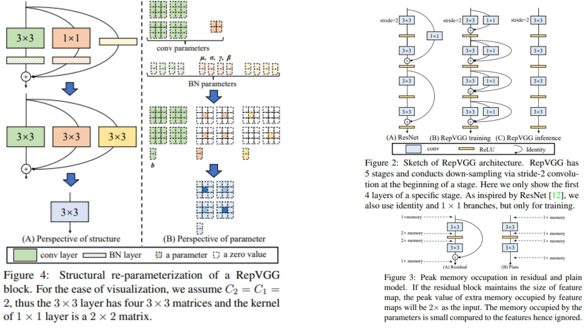

# 🚩 RepVGG-Replication PyTorch Implementation

This repository contains a replication of **RepVGG** using PyTorch. The goal is to build a **VGG-style CNN backbone** with **training-time multi-branch residual blocks** and **structural re-parameterization** for efficient inference.

- Implemented **RepVGG** with plain convolutional backbone and training-time multi-branch residual blocks.  
- Architecture:  
**Conv → ResidualBlock → ... → ResidualBlock → BN → ReLU → AvgPool → Flatten → FC**  
**Paper**: [RepVGG: Making VGG-style ConvNets Great Again](https://arxiv.org/abs/2101.03697)

---
## 🖼 Overview – RepVGG with Structural Re-param

  

**Figure 2:** Sketch of a RepVGG stage. Each stage has multiple blocks; the first layer downsamples via stride-2 convolution. During training, each block has a 3×3 conv, a 1×1 conv, and an identity branch (if dims match), forming a multi-branch structure. For inference, these branches are fused into a single 3×3 conv for efficiency.

**Figure 3:** Memory and computation comparison. Plain ConvNet topology reduces peak memory usage and allows more parallelism, while training-time multi-branch blocks introduce extra memory overhead. After branch fusion, inference latency and memory usage remain minimal.

**Figure 4:** Stage-wise layout of RepVGG. The network has 5 stages with configurable depth and width. Later stages have wider channels for richer features, and depth is concentrated in the penultimate stage for optimal performance.

**Model Overview:**  
RepVGG is a VGG-style plain backbone with training-time multi-branch blocks. Branches are fused for efficient inference while retaining high accuracy. The model balances **simplicity, speed, and memory efficiency** with the **benefit of ensemble-like learning** during training.

---

## 🏗 Project Structure

```bash
RepVGG-Replication/
│
├── src/
│   ├── layers/
│   │   ├── conv_layer.py
│   │   ├── residual_block.py        # RepVGGBlock with train-time multi-branch
│   │   ├── fuse_layers.py           # Kernel/bias fusion helper functions
│   │   ├── shortcut_layer.py
│   │   ├── pool_layers/
│   │   │   ├── maxpool_layer.py
│   │   │   └── avgpool_layer.py
│   │   ├── flatten_layer.py
│   │   └── fc_layer.py
│   │
│   ├── model/
│   │   └── repvgg_model.py
│   │
│   └── config.py
│
├── requirements.txt
└── README.md
```
---

## 🔗 Feedback

For questions or feedback, contact: [barkin.adiguzel@gmail.com](mailto:barkin.adiguzel@gmail.com)
